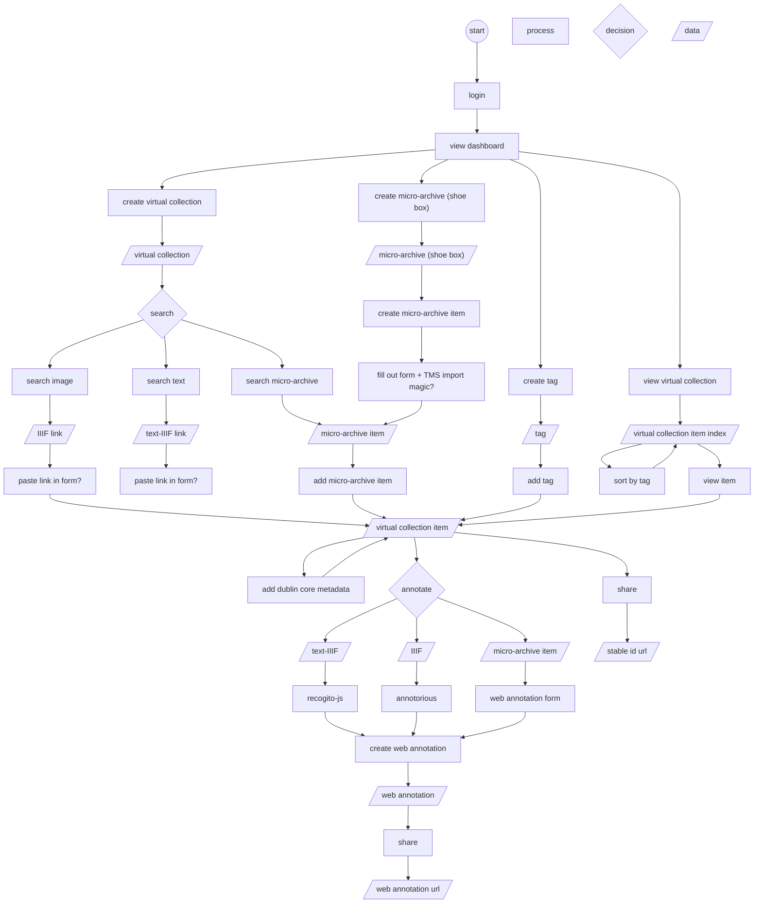

# Dexter

This project aims at building a much-needed solution for referencing and for creating analytical annotations around heterogeneous source material (speech data, survey data, audiovisual recordings, photographs, diaries etc.).

## Development

- Start database:
```shell
docker-compose up -d postgres
```

- Start backend:
```shell
cd backend
make build
export DEX_DATABASE_URL=jdbc:postgresql://0.0.0.0:5432/dexter 
make run-server
```

- Add user:
```shell
curl -X 'POST' 'http://localhost:3001/api/admin/users' \
  -H 'Authorization: Basic cm9vdDpkMzNkMzM=' \
  -H 'Content-Type: application/json' \
  -d '["dexter"]'
```

- Start frontend:
```shell
cd frontend
npm i
npm start
```

- Open http://localhost:3001
- Login with dexter:dexter
- Swagger: http://localhost:3001/api/swagger

## Workflow diagram

