# Dexter

Collect, organize and annotate sources from external digital collections and physical, non-digitized collections in user defined corpora.

_Work in progress_: See the workflow diagram at the bottom for the current status.

## Issues and feature requests

You can create new issues at [Dexter/issues](https://github.com/knaw-huc/Dexter/issues), with a template for bugs and one for features. 

## Development
- Checkout development branch.

Checkout `development` branch.

- Start database:
```shell
docker-compose up -d postgres
```

- Start backend:
```shell
cd backend
make build
export DEX_FLYWAY_LOCATIONS=['filesystem:db']
export DEX_DATABASE_URL=jdbc:postgresql://0.0.0.0:5432/dexter 
make run-server
```

- Start frontend:
```shell
cd frontend
npm i
npm start
```

```shell
# Add non-admin user:
curl -X 'POST' 'http://localhost:8080/admin/users' \
  -H 'Authorization: Basic cm9vdDpkMzNkMzM=' \
  -H 'Content-Type: application/json' \
  -d '["dexter"]'
```

- Open http://localhost:3001
- Login with dexter:dexter

- Further steps:
  - Explore [backend API](http://localhost:8080/swagger#/default)
  - Add languages as documented at [PUT /languages](http://localhost:8080/swagger#/default/seed)

## Workflow diagram

```mermaid  
---
title: "Workflow of rolodex, 'minimal viable product'"
---
graph TD
    START((start))

    AU[action of user]
    AR["🤖 action of rolodex"]
    EN[/entities/]
    
    START --> LOGIN["login@rolodex"]
    LOGIN --> HOME[view dashboard]
    
    START --> SEARCH["search@AAMU website"]
    SEARCH --> VIEWITEM[view specific source]
    VIEWITEM --> COPYHANDLER[copy source handle]
    COPYHANDLER --> ADDHANDLER[add handle to corpus source]
    ADDHANDLER --> IMPORTHANDLER["🤖 import meta data"]
    IMPORTHANDLER --> ADDMETADATA["🤖 add meta data to corpus source"]
    ADDMETADATA --> VCI[/corpus source/]
    
    %% corpus sources:
    HOME --> CVC[create corpus]
    CVC --> VC[/corpus/]
    
    VC --> AVC[add corpus source]
    AVC --> VCI
    
    %% keyword:
    HOME --> CKEYWORD[create keyword]
    CKEYWORD --> KEYWORD[/keyword/]
    KEYWORD --> AKEYWORD[add keyword]
    AKEYWORD --> VCI
    
    KEYWORD-->SORTVC
    
    HOME --> VIEWVC[view corpus]
    VIEWVC --> SORTVC[sort/filter corpus sources]
    SORTVC --> VIEWVCI[view corpus source]
    VIEWVCI --> VCI
    
    VCI -.-> |"(must have, possibly after demo)"|ANN[annotate]
    ANN --> ANNT[annotate text in recogito-js]
    ANNT --> WANN[/web annotation/]
```


