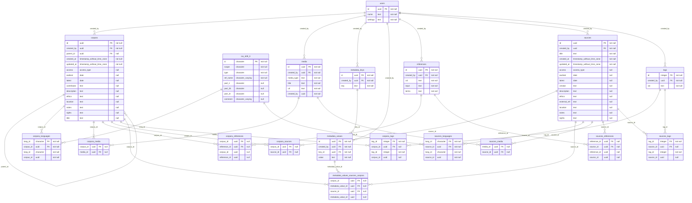

## Diagram

```mermaid
erDiagram

    corpora {
        id uuid PK "not null"
        created_by uuid FK "not null"
        parent_id uuid FK "null"
        created_at timestamp_without_time_zone "not null"
        updated_at timestamp_without_time_zone "not null"
        access access_type "null"
        earliest date "null"
        latest date "null"
        contributor text "null"
        description text "null"
        ethics text "null"
        location text "null"
        notes text "null"
        rights text "null"
        title text "null"
    }

    corpora_languages {
        lang_id character FK "not null"
        corpus_id uuid FK "not null"
        lang_id character "not null"
        corpus_id uuid "not null"
    }

    corpora_media {
        corpus_id uuid FK "null"
        media_id uuid FK "null"
    }

    corpora_references {
        corpus_id uuid FK "null"
        reference_id uuid FK "null"
        corpus_id uuid "null"
        reference_id uuid "null"
    }

    corpora_sources {
        corpus_id uuid FK "null"
        source_id uuid FK "null"
    }

    corpora_tags {
        tag_id integer FK "not null"
        corpus_id uuid FK "null"
        tag_id integer "not null"
        corpus_id uuid "null"
    }

    iso_639_3 {
        id character PK "not null"
        scope character "not null"
        type character "not null"
        ref_name character_varying "not null"
        part_1 character "null"
        part_2b character "null"
        part_2t character "null"
        comment character_varying "null"
    }

    media {
        id uuid PK "not null"
        created_by uuid FK "not null"
        media_type text "not null"
        title text "not null"
        url text "not null"
        created_by uuid "not null"
    }

    metadata_keys {
        id uuid PK "not null"
        created_by uuid FK "not null"
        key text "not null"
    }

    metadata_values {
        id uuid PK "not null"
        created_by uuid FK "not null"
        key_id uuid FK "not null"
        value text "not null"
    }

    metadata_values_sources_corpora {
        corpus_id uuid FK "null"
        metadata_value_id uuid FK "null"
        source_id uuid FK "null"
        metadata_value_id uuid "null"
    }

    references {
        id uuid PK "not null"
        created_by uuid FK "not null"
        csl text "not null"
        input text "not null"
        terms text "not null"
    }

    sources {
        id uuid PK "not null"
        created_by uuid FK "not null"
        title text "not null"
        created_at timestamp_without_time_zone "not null"
        updated_at timestamp_without_time_zone "not null"
        access access_type "null"
        earliest date "null"
        latest date "null"
        creator text "null"
        description text "null"
        ethics text "null"
        external_ref text "null"
        location text "null"
        notes text "null"
        rights text "null"
    }

    sources_languages {
        lang_id character FK "not null"
        source_id uuid FK "not null"
        lang_id character "not null"
        source_id uuid "not null"
    }

    sources_media {
        media_id uuid FK "null"
        source_id uuid FK "null"
    }

    sources_references {
        reference_id uuid FK "null"
        source_id uuid FK "null"
        reference_id uuid "null"
        source_id uuid "null"
    }

    sources_tags {
        tag_id integer FK "not null"
        source_id uuid FK "null"
        tag_id integer "not null"
        source_id uuid "null"
    }

    tags {
        id integer PK "not null"
        created_by uuid FK "not null"
        val text "not null"
    }

    users {
        id uuid PK "not null"
        name text "not null"
        settings text "not null"
    }

    corpora ||--o{ corpora : parent_id
    corpora ||--o{ corpora_languages : corpus_id
    corpora ||--o{ corpora_media : corpus_id
    corpora ||--o{ corpora_references : corpus_id
    corpora ||--o{ corpora_sources : corpus_id
    corpora ||--o{ corpora_tags : corpus_id
    corpora ||--o{ metadata_values_sources_corpora : corpus_id
    iso_639_3 ||--o{ corpora_languages : lang_id
    iso_639_3 ||--o{ sources_languages : lang_id
    media ||--o{ corpora_media : media_id
    media ||--o{ sources_media : media_id
    metadata_keys ||--o{ metadata_values : key_id
    metadata_values ||--o{ metadata_values_sources_corpora : metadata_value_id
    references ||--o{ corpora_references : reference_id
    references ||--o{ sources_references : reference_id
    sources ||--o{ corpora_sources : source_id
    sources ||--o{ metadata_values_sources_corpora : source_id
    sources ||--o{ sources_languages : source_id
    sources ||--o{ sources_media : source_id
    sources ||--o{ sources_references : source_id
    sources ||--o{ sources_tags : source_id
    tags ||--o{ corpora_tags : tag_id
    tags ||--o{ sources_tags : tag_id
    users ||--o{ corpora : created_by
    users ||--o{ media : created_by
    users ||--o{ metadata_keys : created_by
    users ||--o{ metadata_values : created_by
    users ||--o{ references : created_by
    users ||--o{ sources : created_by
    users ||--o{ tags : created_by
```
