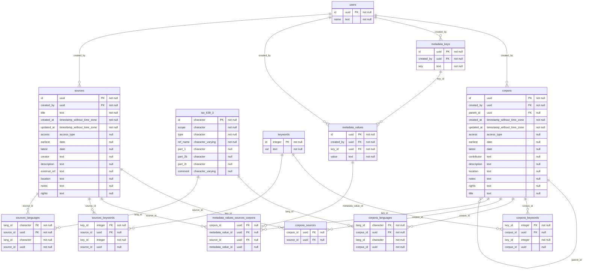

## Database model

```mermaid
erDiagram

    corpora {
        id uuid PK "not null"
        created_by uuid FK "not null"
        parent_id uuid FK "null"
        created_at timestamp_without_time_zone "not null"
        updated_at timestamp_without_time_zone "not null"
        access access_type "null"
        earliest date "null"
        latest date "null"
        contributor text "null"
        description text "null"
        location text "null"
        notes text "null"
        rights text "null"
        title text "null"
    }

    corpora_keywords {
        key_id integer FK "not null"
        corpus_id uuid FK "null"
        key_id integer "not null"
        corpus_id uuid "null"
    }

    corpora_languages {
        lang_id character FK "not null"
        corpus_id uuid FK "not null"
        lang_id character "not null"
        corpus_id uuid "not null"
    }

    corpora_sources {
        corpus_id uuid FK "null"
        source_id uuid FK "null"
    }

    iso_639_3 {
        id character PK "not null"
        scope character "not null"
        type character "not null"
        ref_name character_varying "not null"
        part_1 character "null"
        part_2b character "null"
        part_2t character "null"
        comment character_varying "null"
    }

    keywords {
        id integer PK "not null"
        val text "not null"
    }

    metadata_keys {
        id uuid PK "not null"
        created_by uuid FK "not null"
        key text "not null"
    }

    metadata_values {
        id uuid PK "not null"
        created_by uuid FK "not null"
        key_id uuid FK "not null"
        value text "not null"
    }

    metadata_values_sources_corpora {
        corpus_id uuid FK "null"
        metadata_value_id uuid FK "null"
        source_id uuid FK "null"
        metadata_value_id uuid "null"
    }

    sources {
        id uuid PK "not null"
        created_by uuid FK "not null"
        title text "not null"
        created_at timestamp_without_time_zone "not null"
        updated_at timestamp_without_time_zone "not null"
        access access_type "null"
        earliest date "null"
        latest date "null"
        creator text "null"
        description text "null"
        external_ref text "null"
        location text "null"
        notes text "null"
        rights text "null"
    }

    sources_keywords {
        key_id integer FK "not null"
        source_id uuid FK "null"
        key_id integer "not null"
        source_id uuid "null"
    }

    sources_languages {
        lang_id character FK "not null"
        source_id uuid FK "not null"
        lang_id character "not null"
        source_id uuid "not null"
    }

    users {
        id uuid PK "not null"
        name text "not null"
    }

    corpora ||--o{ corpora : "parent_id"
    corpora ||--o{ corpora_keywords : "corpus_id"
    corpora ||--o{ corpora_languages : "corpus_id"
    corpora ||--o{ corpora_sources : "corpus_id"
    corpora ||--o{ metadata_values_sources_corpora : "corpus_id"
    iso_639_3 ||--o{ corpora_languages : "lang_id"
    iso_639_3 ||--o{ sources_languages : "lang_id"
    keywords ||--o{ corpora_keywords : "key_id"
    keywords ||--o{ sources_keywords : "key_id"
    metadata_keys ||--o{ metadata_values : "key_id"
    metadata_values ||--o{ metadata_values_sources_corpora : "metadata_value_id"
    sources ||--o{ corpora_sources : "source_id"
    sources ||--o{ metadata_values_sources_corpora : "source_id"
    sources ||--o{ sources_keywords : "source_id"
    sources ||--o{ sources_languages : "source_id"
    users ||--o{ corpora : "created_by"
    users ||--o{ metadata_keys : "created_by"
    users ||--o{ metadata_values : "created_by"
    users ||--o{ sources : "created_by"
```
